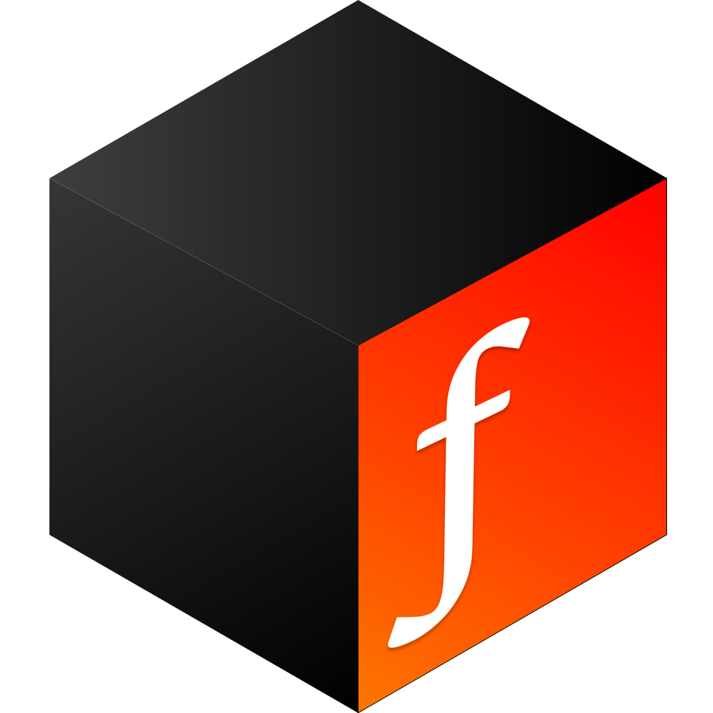

<div align="center">
  

# TiTanF

**High-Performance, Zero-Dependency TrueType Font Rasterizer**

[](https://crates.io/crates/titanf)
[](https://docs.rs/titanf)
[](LICENSE)
[](https://docs.rust-embedded.org/book/)

</div>

<br>

## 📖 Overview

**TiTanF** is a production-grade TrueType font rasterizer implemented entirely in Rust without any external dependencies (`libc`, `freetype`, etc.). It was engineered for high-performance vector graphics rendering in embedded systems and OS development.

The library features a hand-written parser for the TrueType format, a robust geometry processing pipeline, and a custom anti-aliased rasterizer accelerated by SIMD instructions.

## ✨ Key Features

- **🚀 SIMD Accelerated:** Optimized pixel coverage accumulation using SSE2 (x86_64) and NEON (AArch64).
- **📦 Zero Dependencies:** No C bindings, no system libraries—just pure Rust.
- **🔌 Embedded Ready:** Fully `no_std` compatible (requires `alloc`), ideal for kernels and bootloaders.
- **🛡️ Memory Safe:** 99% safe Rust, with `unsafe` used strictly for SIMD intrinsics.
- **📄 Robust Parsing:** Zero-copy parsing of TrueType tables (`glyf`, `cmap`, `kern`, `hmtx`, etc.).

## 🏗️ Architecture

The rendering pipeline is split into three distinct stages:

1.  **Parsing (`src/tables`):** Raw binary data is parsed into strongly-typed structures. Complex glyph data is lazy-loaded.
2.  **Geometry (`src/geometry`):** Extraction of quadratic Bezier curves and recursive flattening into monotonic line segments.
3.  **Rasterization (`src/rasterizer`):** Analytic area coverage algorithm (DDA) followed by a SIMD parallel prefix sum accumulation.

## 🚀 Quick Start

Add to your `Cargo.toml`:

```toml
[dependencies]
titanf = "2.1.0"
```

Basic usage:

```rust
use titanf::TrueTypeFont;

fn main() {
    let font_data = include_bytes!("font.ttf");
    let mut font = TrueTypeFont::load_font(font_data).expect("Failed to parse font");
    
    // Rasterize 'A' at 24px
    let (metrics, bitmap) = font.get_char::<true>('A', 24.0);
    println!("Rendered 'A': {}x{} pixels", metrics.width, metrics.height);
}
```

## 📊 Performance

Benchmarks performed on an AMD Ryzen 9 5900X rendering **1,000 characters** (Mixed CJK & Latin).

| Font Size | **TiTanF** | RustType | ab_glyph | Fontdue |
| :--- | :--- | :--- | :--- | :--- |
| **12px** | **18.4 ms** | 18.6 ms | 16.9 ms | 4.8 ms |
| **72px** | **51.5 ms** | 54.8 ms | 51.9 ms | 24.0 ms |
| **120px** | **86.4 ms** | 99.5 ms | 98.0 ms | 51.2 ms |
| **250px** | **244.0 ms** | 304.1 ms | 296.0 ms | 165.2 ms |

## 📜 License

This project is licensed under the MIT License - see the [LICENSE](LICENSE) file for details.
